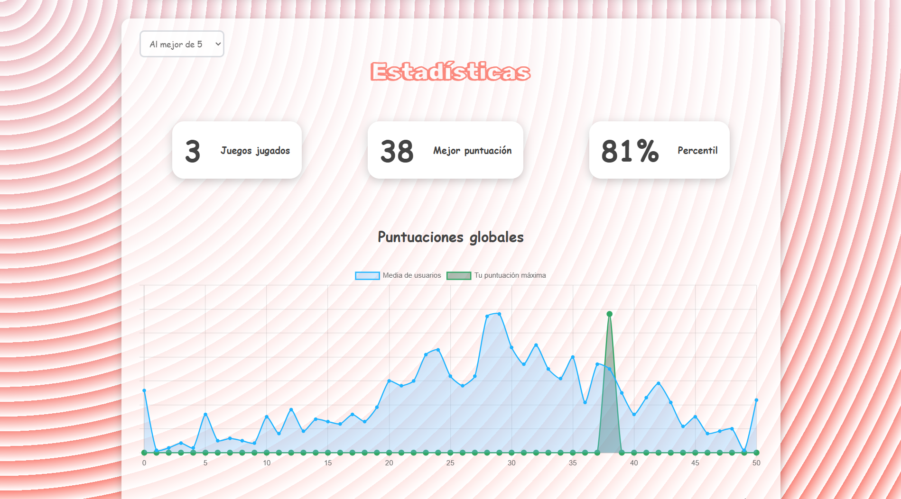
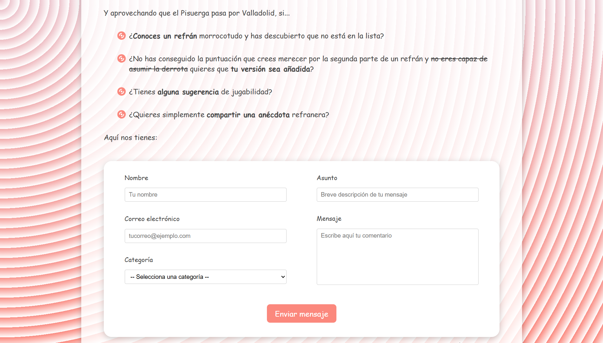

# Refrandle

## Descripción

Bienvenidxs a **Refrandle**, el juego online definitivo de adivinar refranes en español. Completa los refranes de toda la vida, pon a prueba tu ingenio, compite con amigos y descubre nuevos dichos populares.

Puedes [jugar aquí](https://refrandle.es/).

### Página de juego

### Página de ayuda

### Página de estadísiticas

### Página de contacto

## ¿Cómo se juega?

En **Refrandle** podrás poner a prueba tu sabiduría popular. Cada refrán aparecerá dividido en **dos partes:**

- **Verás la primera mitad** del refrán escrita en pantalla.  
- **Tu misión será escribir la segunda parte** que corresponda en el recuadro de texto.

### Modos

Elegir el reto que más se ajuste a ti es lo más importante, por eso **Refrandle** cuenta con cuatro modos de juego distintos a escoger:

1. **Al mejor de 5**  
   Pon a prueba tu memoria con estos **5 refranes**. Los favoritos tu abuela. Los refranes que hicieron llorar a Steven Spielberg. Ideal para una partida rápida.

2. **Al mejor de 10**  
   Un reto intermedio con **10 refranes** para demostrar tu saber popular. Los refranes favoritos de tus refranes favoritos. Nunca antes ser pedante fue tan fácil.

3. **Al mejor de 20**  
   ¿Siempre eliges el modo difícil en los videojuegos? ¿Tienes la aplicación de la RAE en el móvil? Prueba a llegar al final de estos **20 refranes** y conseguir la máxima puntuación.

4. **Supervivencia**  
   ¡Un no parar de emociones refrantásticas! Irán apareciendo refranes **uno tras otro** y solo seguirás jugando **mientras aciertes**. En cuanto falles... se acabó la partida. Pero, ¿este modo tiene final? Si lo tiene... ¿serás capaz de llegar hasta él? ¿Podrás tú convertirte… en el **Refrandle**?

### Puntuaciones

Las reglas para sumar puntos son iguales en todos los modos de juego. No tiene pérdida: **cuanto más aciertes, más puntos ganarás**. Aunque, ya que tiene su propia sección, no viene mal explicar con mayor profundidad los tres tipos de respuesta que se pueden sacar.

1. **Respuesta correcta**  

    
    
    Si completas **correctamente toda la segunda parte** del refrán, obtendrás **10 puntos**. Hay más de una versión correcta del mismo refrán, así que no te preocupes y escribe el refrán como lo has escuchado toda tu vida.

2. **Respuesta parcialmente correcta**  
   
    

    Si tu respuesta **incluye solo algunas palabras** de la solución completa, tu respuesta será parcialmente correcta, lo que significa que conseguirás una puntuación menor a la máxima posible. Sin embargo, que esto no te quite las ganas de tocar de oído, ya que se otorgarán puntos de manera proporcional al refrán: **a más palabras acertadas de la solución, más puntos**.

3. **Respuesta incorrecta**

    

    Si **no aciertas ninguna palabra** de la segunda parte del refrán, tu respuesta será incorrecta y **no sumarás ningún punto**. En el modo de Supervivencia esto también implicará perder de forma automática.